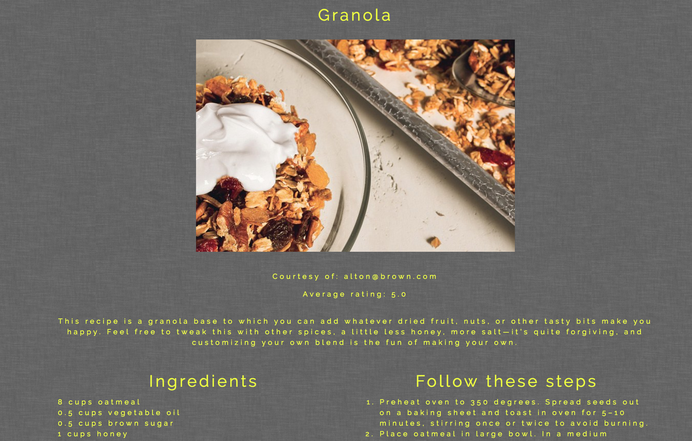

# [Treats recipe site](https://grecipes-f85d1.firebaseapp.com/)
## Project description
This was one of the collaborative full stack projects I worked on during my quarter 2 at Galvanize. We learned databse manipulation 
with PostgreSQL and Knex, setting up servers with Express and transfering information from front to back with CRUD routes. 
Together with my teammate we developed an ERD and then split up the project into front and back end tasks. My primary responsibility 
was to work on the front end, fetch and send data from/to the database and create visual representation of it. We deployed the 
front end to Firebase, while hosting the DB on Heroku.

## Site description
[Treats](https://grecipes-f85d1.firebaseapp.com/) recipe site provides the user with the ability to view, create and delete recipes.
It is structured in the following way:
1. Main page allows the user to see all the recipes sorted by an average star rating

2. Each recipe card on the main page is clickable and will take the user to a full description recipe page, where she can edit or delete the recipe
or add and view comments and reviews left by others. This page will also allow the user to edit or delete comments.

3. Edit recipe page is populated with the data from the current clicked recipe and provides the user with an opportunity to adjust the UOM,
quantity, ingredients, execution steps, and the description of the recipe.

4. Add new recipe link in the top right corner allows the user to create and save their recipe.

